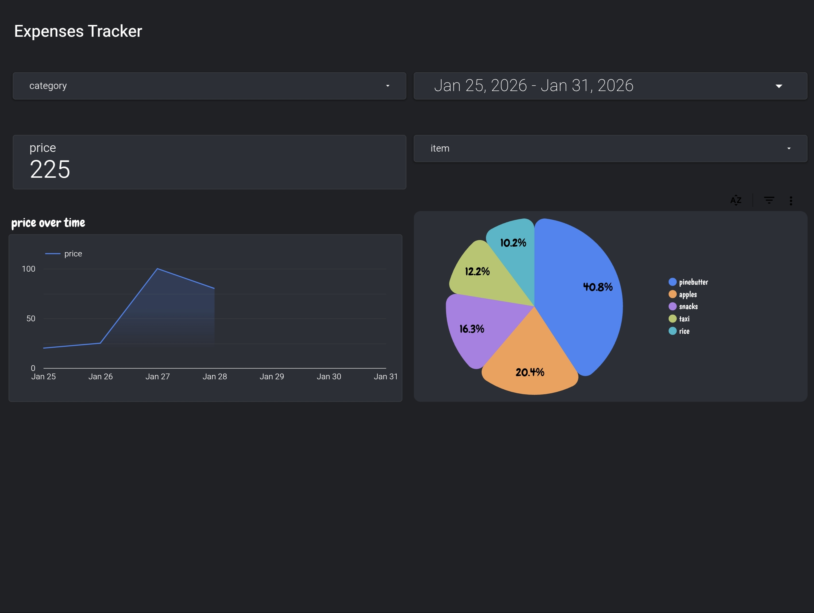

# 💰 AI Expense Manager Bot

A smart automation agent that simplifies expense tracking. It allows users to send expenses via **Voice**, **Text**, or **Images** (receipts) to a Telegram bot. The data is processed by AI and visualized in a real-time dashboard.

## 🚀 Features

- **Multi-Modal Input:** Accepts voice notes ("Spent 50 on coffee"), text messages, and photos of receipts.
- **AI Processing:** Uses **Google Gemini** to extract amounts, categories, and dates automatically.
- **Voice Logic:** Distinguishes between expense inputs and general questions.
- **Data Storage:** Automatically logs structured data into **Google Sheets**.
- **Visualization:** Connects to **Google Looker Studio** for interactive charts and weekly insights.

## 🛠️ Tech Stack

- **Orchestration:** [Make.com](https://www.make.com/) (formerly Integromat)
- **AI Logic:** Google Gemini API (1.5 Flash)
- **Interface:** Telegram Bot API
- **Database:** Google Sheets
- **Frontend/Dashboard:** Google Looker Studio

## ⚙️ How It Works (Workflow)

1. **User sends input** (e.g., voice note) to Telegram.
2. **Make.com** triggers the scenario and downloads the file.
3. **Gemini AI** analyzes the content:
   - If it's an expense -> Extracts `price`, `Category`, `Date`.
   - If it's a photo -> OCRs the receipt.
4. Data is validated and **added to Google Sheets**.
5. **Looker Studio** updates the dashboard in real-time.

## 📸 Screenshots

---
*Built with ❤️ by [Your Name]*
